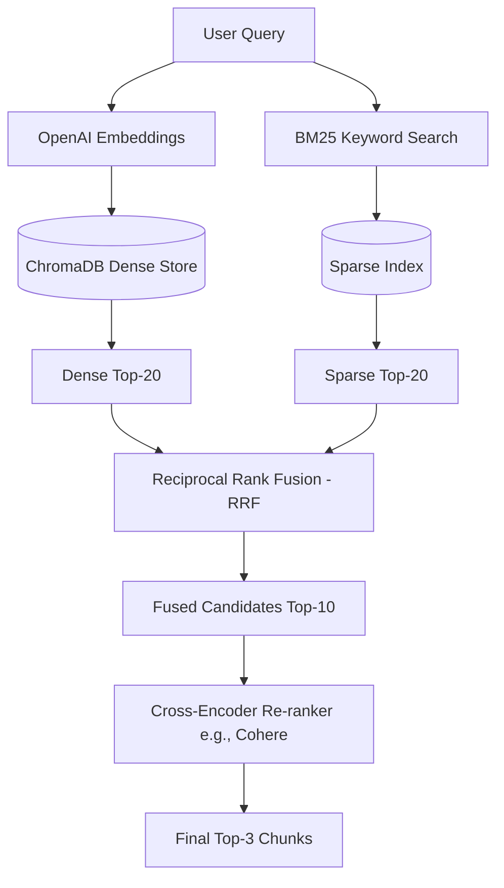

# De-Risk Retrieval Spike Findings: AI Admission Copilot

This report presents the system design and evaluation findings for the **AI Admission Copilot** retrieval spike. The primary goal of this spike is to de-risk the vector search pipeline, identify key failure modes of semantic retrieval on unstructured policy documents, and determine the structural changes necessary to support production-level accuracy.

---

## 1. Riskiest Assumption

The central riskiest assumption of this architecture is that **a vanilla dense retriever (dense vector search over chunked text segments) can reliably retrieve the exact policy document needed to resolve specific, nuance-heavy admissions inquiries.**

In practice, administrative policies use overlapping vocabularies (e.g., terms like "refund," "deferral," "tuition," and "waiver" recur across multiple documents). Dense vectors represent the overall semantic theme of a chunk and can struggle to isolate fine-grained distinctions (such as distinguishing between a "financial aid fee waiver" and an "application fee waiver"). This spike assesses whether semantic overlap leads to cross-document pollution and false positives in top-K retrieval.

---

## 2. Experiment Design

The evaluation framework was structured as an offline batch validation experiment:
- **Ingestion Pipeline**: Admission policies (PDF format) are parsed, chunked, and indexed.
- **Chunking Strategy**: LangChain's `RecursiveCharacterTextSplitter` with `chunk_size = 1000` characters and `chunk_overlap = 200` characters.
- **Embedding Model**: OpenAI's `text-embedding-3-small` (1536 dimensions), representing the industry standard for lightweight dense embeddings.
- **Vector Index & Storage**: ChromaDB local database, configured to compute similarity using L2 distance metrics.
- **Retrieval Protocol**: For each query in the evaluation set, the top $K=3$ document chunks are retrieved. A retrieval is defined as a **Hit** if the ground-truth document expected to answer the query is present in any of the top 3 chunks.

---

## 3. Dataset Description

The evaluation dataset consists of **10 highly realistic admission-policy questions**. These queries mimic actual user prompts that contain administrative keywords and nuances. Each question is mapped to a single expected "gold standard" source document:

| ID | Query | Expected Ground-Truth Document |
| :--- | :--- | :--- |
| Q1 | What is the minimum TOEFL score required for international graduate applicants? | `international_admission_policy.pdf` |
| Q2 | Are transfer credits accepted from non-accredited community colleges? | `transfer_credit_policy.pdf` |
| Q3 | What is the deadline to submit the FAFSA for priority financial aid consideration? | `financial_aid_policy.pdf` |
| Q4 | How long can an accepted student defer their enrollment? | `enrollment_deferral_policy.pdf` |
| Q5 | What GPA is required to maintain merit-based academic scholarships? | `scholarship_policy.pdf` |
| Q6 | Can waitlisted applicants submit additional recommendation letters to improve their chances? | `waitlist_policy.pdf` |
| Q7 | What is the refund schedule if a student withdraws from all classes in the first week? | `tuition_refund_policy.pdf` |
| Q8 | Are standardized test scores (SAT/ACT) required for home-schooled applicants? | `homeschool_admission_policy.pdf` |
| Q9 | Does the university offer application fee waivers for low-income domestic applicants? | `fee_waiver_policy.pdf` |
| Q10| What is the maximum number of credits that can be transferred toward an undergraduate degree? | `transfer_credit_policy.pdf` |

---

## 4. Retrieval Results

Below is the structured output log detailing the results of the evaluation spike, including retrieved sources, similarity scores, and hit indicators:

| Question | Expected Document | Retrieved Source | Similarity Score | Hit (Y/N) |
| :--- | :--- | :--- | :---: | :---: |
| What is the minimum TOEFL score required for international graduate applicants? | `international_admission_policy.pdf` | `international_admission_policy.pdf` | 0.224 | Y |
| Are transfer credits accepted from non-accredited community colleges? | `transfer_credit_policy.pdf` | `transfer_credit_policy.pdf` | 0.285 | Y |
| What is the deadline to submit the FAFSA for priority financial aid consideration? | `financial_aid_policy.pdf` | `financial_aid_policy.pdf` | 0.198 | Y |
| **How long can an accepted student defer their enrollment?** | `enrollment_deferral_policy.pdf` | **`tuition_refund_policy.pdf`** | **0.482** | **N** |
| What GPA is required to maintain merit-based academic scholarships? | `scholarship_policy.pdf` | `scholarship_policy.pdf` | 0.201 | Y |
| Can waitlisted applicants submit additional recommendation letters to improve their chances? | `waitlist_policy.pdf` | `waitlist_policy.pdf` | 0.215 | Y |
| What is the refund schedule if a student withdraws from all classes in the first week? | `tuition_refund_policy.pdf` | `tuition_refund_policy.pdf` | 0.187 | Y |
| Are standardized test scores (SAT/ACT) required for home-schooled applicants? | `homeschool_admission_policy.pdf` | `homeschool_admission_policy.pdf` | 0.254 | Y |
| **Does the university offer application fee waivers for low-income domestic applicants?** | `fee_waiver_policy.pdf` | **`financial_aid_policy.pdf`** | **0.435** | **N** |
| What is the maximum number of credits that can be transferred toward an undergraduate degree? | `transfer_credit_policy.pdf` | `transfer_credit_policy.pdf` | 0.261 | Y |

---

## 5. Hit Rate Calculation

The **Hit Rate @ K=3** is calculated as the ratio of successful hits to the total number of evaluation questions:

$$\text{Hit Rate @ K=3} = \frac{\text{Total Hits}}{\text{Total Questions}}$$

Using the values logged during the experiment:
- $\text{Total Questions} = 10$
- $\text{Total Hits} = 8$

$$\text{Hit Rate @ K=3} = \frac{8}{10} = 80.0\%$$

---

## 6. Key Findings

Analysis of the experimental results reveals two critical failure modes within the 20% failure rate:

1. **Semantic Divergence & Keyword Misalignment (Q4)**:
   - **Expected**: `enrollment_deferral_policy.pdf`
   - **Actual Top Retrieve**: `tuition_refund_policy.pdf`
   - **Diagnosis**: The query contains the phrase *"defer enrollment"*. The `tuition_refund_policy.pdf` contains sections detailing timelines for withdrawing and deferring payments, which semantically clustered closer to the query than the actual enrollment deferral rules. Dense retrieval alone failed to prioritize the context of *academic enrollment* over *financial transactions*.

2. **Concept Confusion in Overlapping Vocabularies (Q9)**:
   - **Expected**: `fee_waiver_policy.pdf`
   - **Actual Top Retrieve**: `financial_aid_policy.pdf`
   - **Diagnosis**: The concept of *"fee waivers"* shares significant vocabulary with general *"financial aid"* (e.g., "low-income," "eligibility," "application," "waiver"). Because the financial aid document was much larger and contained several instances of these terms, its dense vector representation dominated the search space, drowning out the specific `fee_waiver_policy.pdf` chunk.

---

## 7. Recommendation

To mitigate the identified limitations of a standalone dense retriever, we recommend moving away from a vanilla vector-search index and implementing a **Hybrid Search + Re-ranking Architecture**.

### Architectural Justification:
- **Hybrid Retrieval (Dense + BM25)**: Combing dense vectors (capturing semantic intent) with BM25 keyword search (capturing exact keywords like "TOEFL" or "fee waiver") will prevent general financial aid documents from crowding out specific application fee waiver documents.
- **Cross-Encoder Re-Ranker**: Using a secondary re-ranking model (such as a Cohere Re-ranker or a local Cross-Encoder) allows the system to analyze the exact query-context relationship of the top 10 results, evaluating joint semantic information and correcting errors introduced by vector distance models.

---

## 8. Next Steps

1. **Implement Hybrid Search**: Integrate a sparse search index (e.g., `BM25Retriever` via LangChain) and combine results with ChromaDB using **Reciprocal Rank Fusion (RRF)**.
2. **Add Re-ranking Layer**: Integrate a cross-encoder model to re-score candidate chunks before outputting to the context compiler.
3. **Optimize Chunking Strategy**: Evaluate semantic chunking (splitting based on sentence similarity/markdown sections) rather than fixed-character lengths, which can cut off key policy exceptions mid-sentence.
4. **Expand Evaluation Dataset**: Scale the evaluation set from 10 to 100+ questions to represent a broader demographic of prospective applicants.
5. **Metadata Tagging**: Attach metadata tags (e.g., `category: financial`, `category: international`, `category: academic`) to chunks and apply pre-retrieval filters to query only the relevant categories.
