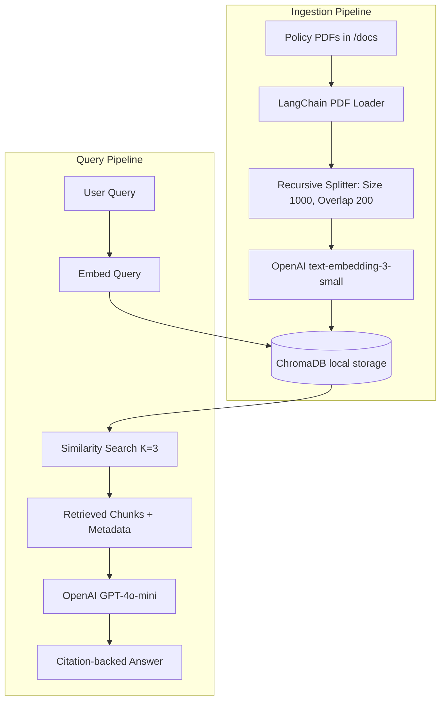

# System Architecture Design: AI Admission Copilot

This document outlines the software architecture and data pipeline design for the AI Admission Copilot system.

---

## 1. System Architecture

The system is designed around a **Modular RAG (Retrieval-Augmented Generation)** pattern. The block diagram below illustrates the ingestion and query processing pipelines:

---

## 2. Ingestion Pipeline Detail
- **PDF Loader**: Uses `PyPDFDirectoryLoader` to read documents page-by-page.
- **Splitter**: Uses `RecursiveCharacterTextSplitter` configured with character delimiters `["\n\n", "\n", " ", ""]` to ensure boundaries between paragraphs are maintained, avoiding splitting mid-term.
- **Metadata Preservation**: Each document chunk maintains:
  - `source`: File path (converted to basename) for citation tracking.
  - `page`: Page index within the source PDF.
  - `start_index`: Character offset within the document for exact search alignment.

---

## 3. Database Selection
- **Spike Database**: ChromaDB (lightweight, SQLite-backed, local persistence).
- **Production Database**: Proposed transition to **Qdrant** or **pgvector (PostgreSQL)** to support horizontal scaling, metadata filtering at scale, and high-concurrency connections.
