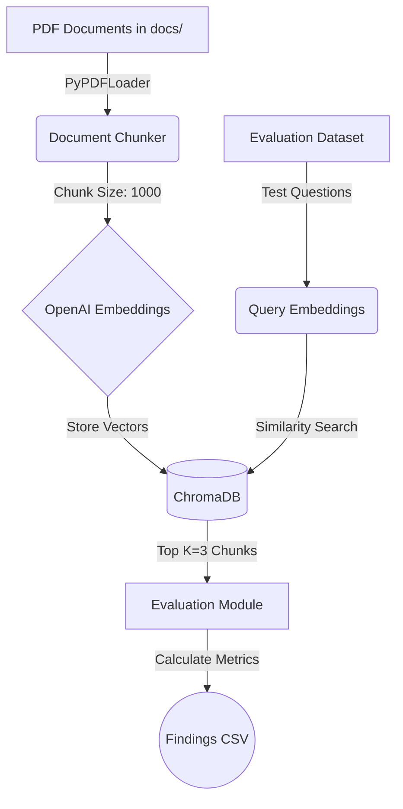

# 🚀 AI Admission Copilot - Retrieval Spike (De-risk Phase)

[](https://www.python.org/)
[]()
[]()

Welcome to the **Retrieval Spike** for the AI Admission Copilot. This component exists to **de-risk the RAG (Retrieval-Augmented Generation) pipeline** by quickly prototyping, testing, and evaluating our chunking strategies, vector embeddings, and retrieval accuracy before committing to a full-scale backend implementation.

---

## 🎯 Spike Objectives

1. **Test Ingestion**: Can we successfully parse complex university admission PDFs?
2. **Optimize Chunking**: What is the right `CHUNK_SIZE` and `CHUNK_OVERLAP` to maintain semantic meaning?
3. **Evaluate Embeddings**: Validate the accuracy of `text-embedding-3-small` in capturing nuanced admission policies.
4. **Measure Hit Rate**: Ensure the system retrieves the correct source document within the top 3 results (**Hit Rate @ K=3**).

---

## 🏗️ Architecture & Pipeline

The retrieval pipeline follows a standard RAG data-prep and query workflow:



---

## 📂 Folder Structure

```text
spike/
├── README.md          # Spike documentation and setup guide (you are here)
├── config.py          # Centralized configuration (hyperparameters, constants)
├── evaluation.py      # Core logic for evaluating Hit Rate and logging results
├── main.py            # Orchestrator script to run the end-to-end spike pipeline
├── requirements.txt   # Python dependencies (LangChain, ChromaDB, OpenAI)
└── retrieval.py       # Ingestion, chunking, embedding, and indexing logic
```

---

## ⚙️ Hyperparameters (`config.py`)

You can tweak the performance of the retrieval pipeline by adjusting the variables in `config.py`:

- `CHUNK_SIZE` (default: `1000`): The character limit for each document segment.
- `CHUNK_OVERLAP` (default: `200`): Overlap between chunks to prevent cutting off context midway through a sentence.
- `TOP_K` (default: `3`): The number of chunks returned during the vector search. The evaluation calculates Hit Rate at this `K`.
- `DATA_FOLDER` (default: `"docs"`): The relative folder where PDF documents should be placed.

---

## 🚀 Getting Started

### 1. Prerequisites
Ensure you have activated your virtual environment and installed the dependencies:
```bash
pip install -r spike/requirements.txt
```

### 2. Environment Variables
Provide your OpenAI API key in a `.env` file located at the project root:
```env
OPENAI_API_KEY=sk-your-actual-api-key
```

### 3. Add Documents
Place your sample admission PDFs in a folder named `docs` in the root of the workspace.

### 4. Run the Spike
Execute the pipeline from the project root:
```bash
python -m spike.main
```

---

## 📊 Evaluation & Metrics

The `evaluation.py` module runs a deterministic dataset of questions against the indexed vector database. For every query, it checks if the **Target Document** (the document we know contains the answer) is present in the **Top-K retrieved documents**.

At the end of the run, the spike provides:
- A console summary displaying **Hit Rate @ K=3**.
- A detailed log in `findings.csv` containing similarity scores and boolean hits for every test query.
